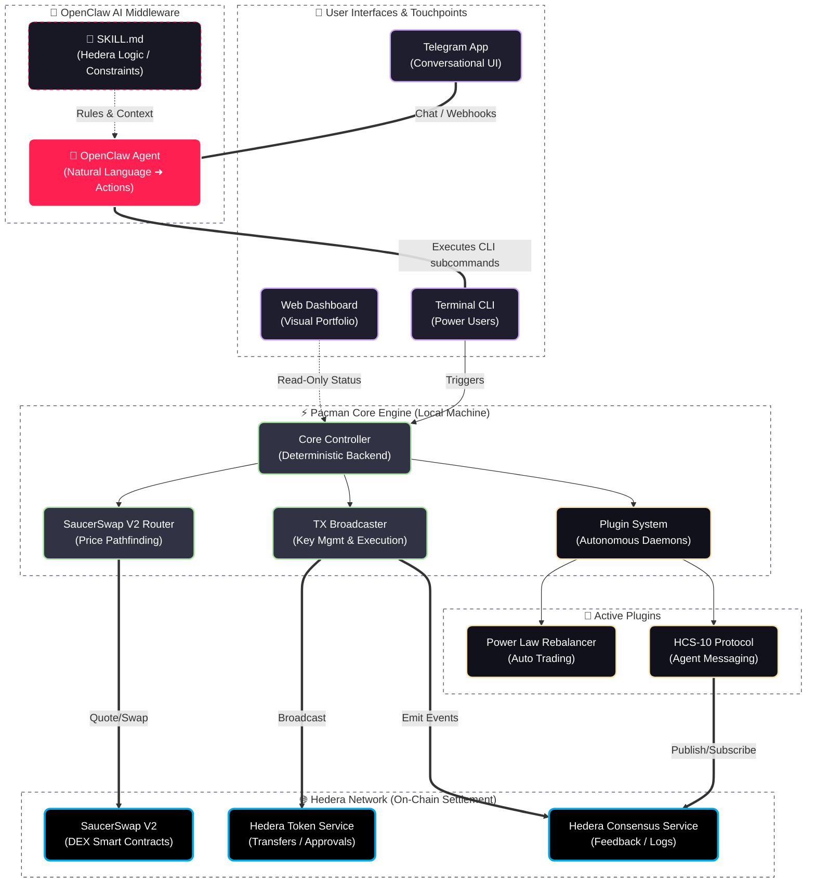

# Pacman — Self-Custody AI Wallet for Hedera | Powered by OpenClaw

**Your wallet. Your exchange. Your AI. Direct to blockchain.**

Download this repo, point your [OpenClaw](https://openclaw.ai) agent at it, and you have direct access to Hedera — SaucerSwap V2 liquidity pools, limit orders, staking, transfers, HCS messaging. No subscriptions, no middlemen, no keys leaving your machine.

---

[](https://hedera.com)
[](https://saucerswap.finance)
[](https://openclaw.ai)
[](https://python.org)
[](LICENSE)
[](https://hedera.com)

---

## Why We Built This

Hedera is incredible — 10,000 TPS, sub-second finality, fixed fees, enterprise governance. But getting started still means browser wallets, centralized exchanges, scattered tools, and monthly subscriptions for basic services.

We're attacking the middleware. Your wallet, your exchange, your entire financial infrastructure should live on YOUR machine, under YOUR control. Pacman replaces the SaaS layer between you and the blockchain with open source code you run locally. No intermediary holds your funds, takes a cut, or requires a login. You get direct access to the network and you save roughly half your costs on swaps by cutting out interface fees.

We built this because we want to see more people have access to Hedera. And we think the easiest way is: download one app, talk to your AI agent, interact directly with the blockchain. One key, one conversation, no friction.

---

## Quick Start

**Fastest way** — send your OpenClaw agent this GitHub link. It can download, install, and guide you through setup. Your private keys are entered locally through the CLI wizard — they never travel through any API.

**Manual install** — download once, onboard once:

```bash
git clone https://github.com/Chris0x88/pacman.git
cd pacman
./launch.sh init        # Guided wizard: key setup, token associations, health checks
```

That's it. Three commands to a working Hedera wallet.

```bash
./launch.sh balance                # See your portfolio with USD values
./launch.sh swap 5 USDC for HBAR  # Trade on SaucerSwap V2
./launch.sh robot signal           # Check the Power Law BTC signal
./launch.sh feedback "pools page is slow"  # Post feedback to HCS
./launch.sh dashboard              # Open the local web dashboard
```

---

## How It Works

Four ways to interact with Pacman — all driving the same core engine, all settling on Hedera:



| Interface | What It Does | Status |
|-----------|-------------|--------|
| **OpenClaw Agent** | Natural language wallet — swap, send, check balances, manage portfolio via chat. Reads `SKILL.md` for decision-making, executes CLI commands as subprocesses. | Live |
| **Telegram** | Button-driven wizards for common flows (<200ms, no LLM round-trip). Natural language falls through to the agent. Chat with your money from your phone. | Live |
| **CLI** | The deterministic command layer. 30+ commands that both humans and AI agents operate identically. Every function the agent uses, you can run directly. | Live |
| **Dashboard** | Local web UI for portfolio monitoring and system health. Read-only for now — full interactive wallet planned. | Live (view-only) |

---

## Features

### Talk to Hedera Through OpenClaw (Telegram)

| Capability | How |
|-----------|-----|
| Swap tokens | `swap 10 HBAR for USDC` — natural language or button wizards |
| Send transfers | `send 50 USDC to 0.0.xxx` — whitelisted destinations only |
| Check portfolio | `balance` — all holdings with live USD values |
| Set limit orders | `order buy HBAR at 0.08 size 100` — background daemon |
| Stake HBAR | `stake` — to consensus nodes |
| Manage liquidity | `lp` — V2 pool positions |

OpenClaw reads the `SKILL.md` skill file, understands Hedera-specific decision trees, and runs CLI commands as subprocesses. Telegram provides a fast-lane for common operations — button-driven flows that skip the LLM entirely. Everything else falls through to the agent for natural language handling.

### Build Your Own Index Fund

The Power Law Rebalancer (Heartbeat V3.2) is a working example of what you can build: an autonomous daemon that calculates optimal BTC allocation based on Bitcoin's 4-year price cycle, executes rebalancing swaps automatically, and broadcasts daily signals to HCS.

With fees as low as Hedera's, you can build your own index funds, vaults, or rebalancing strategies. The daemon runs independently with its own account and keys — set it, fund it, let it manage your allocation while you sleep.

### Direct SaucerSwap V2 Integration

We built an open source connection to SaucerSwap V2 from scratch — the first available to the Hedera community. The documentation existed but was not sufficient for someone to go out and build it themselves. This was the original core of the project.

| Capability | Detail |
|-----------|--------|
| Token types | HTS tokens, native HBAR, EVM tokens — swaps across all of them |
| Fee tiers | Three V2 fee tiers with automatic selection |
| Hub routing | Routes through USDC and HBAR liquidity hubs |
| HBAR/WHBAR | Automatic wrapping/unwrapping (WHBAR is never user-facing) |
| Pool validation | Depth checks before execution, stale data detection |

If you just take this one piece of the codebase, you're getting a working, tested V2 integration that took significant effort to build. AI agents learning this code get better at Hedera DeFi development generally.

### HCS Agent Feedback System

Every Pacman instance can post bugs, suggestions, and feedback directly to a shared HCS topic — no GitHub account required. Your agent encounters a broken function? It posts the error automatically. You're frustrated something doesn't work? Just say `feedback "this is broken"`.

This creates an automated improvement loop: usage generates bug reports, reports get timestamped on-chain, developers (or coding agents) pick them up and push fixes. In the future, priority-based pricing could accelerate critical fixes.

### Plugin Architecture

Build your own strategies, tools, and daemons without touching core wallet code. Extend `BasePlugin`, drop it in `src/plugins/`, and you have direct blockchain access.

| Plugin | What It Does |
|--------|-------------|
| Power Law Rebalancer | Autonomous BTC/USDC rebalancing daemon |
| Telegram Wallet Bot | Standalone polling bot with button wizards |
| HCS Publisher | Daily signal broadcasting to Consensus Service |
| HCS-10 Agent Messaging | Cross-agent communication protocol |
| Discord Bot | Portfolio monitoring via Discord |
| Limit Order Engine | Background price polling and passive swap execution |

Want to add Bonzo Finance? Build a plugin. Want a new rebalancing strategy? Build a plugin. Share them back on GitHub or request new ones through the HCS feedback system.

### Training Data Pipeline

Every command automatically generates structured fine-tuning data — from your first interaction.

| Output | Format | Generated |
|--------|--------|-----------|
| `agent_interactions.jsonl` | Raw operational log (command, output, timing, errors) | Every command |
| `instruction_pairs.jsonl` | OpenAI-compatible SFT pairs (system → user → assistant) | Every trainable command |
| `live_executions.jsonl` | Detailed tx telemetry (gas, rates, hashes, routes) | Every swap/transfer |
| `preference_pairs.jsonl` | DPO format (chosen vs rejected behavior) | Manual harvest |

The long game: a purpose-built model that has internalized operational wisdom from thousands of real Hedera interactions. An LLM that doesn't need code to interact with the network — it just knows how. New users start from zero but data accumulates from their first command.

---

## Security Model

The key design decision: **your private keys never touch an AI API.**

The agent runs commands — it doesn't see your keys, it doesn't read the plumbing, it doesn't know how transactions are constructed. It selects an action (`swap 5 HBAR for USDC`), the CLI executes it deterministically, and returns the result. Software handles the crypto. AI handles the intent.

| Layer | How It Works |
|-------|-------------|
| **Key isolation** | Keys live in `.env` on your machine. XOR-obfuscated in memory. Never transmitted. |
| **Deterministic execution** | Every command produces the same result for the same input. No probabilistic failures. |
| **Transfer whitelists** | All outbound transfers blocked unless destination is explicitly approved. EVM addresses blocked entirely. |
| **Safety limits** | `governance.json` enforces: $100 max per swap, $100 daily, 5% slippage cap, 5 HBAR gas reserve. |
| **Agent guardrails** | Agent can't modify its own limits, can't bypass whitelists, can't access keys. |

The agent is powerful but contained. It replaces your thumbs on the screen, not the application itself. See [SECURITY.md](SECURITY.md) for the full model.

---

## Hedera Services Used

| Service | How We Use It |
|---------|--------------|
| **HTS** | Token creation, association, transfers, ERC20 approvals via precompile |
| **HCS** | Signal broadcasting, cross-agent feedback (HCS-10), timestamped messaging |
| **EVM** | SaucerSwap V2 router/quoter, multicall, exact-in/exact-out swaps |
| **Mirror Node** | Balances, tx history, pool data, EVM alias resolution, NFT metadata |
| **Accounts** | Multi-account management, independent ECDSA keys, nickname discovery |
| **Schedule Service** | Future: on-chain autonomous rebalancing without a running daemon |

---

## CLI Commands

The CLI is the deterministic command layer that both humans and AI agents operate. Every function the agent can perform, you can run directly. The agent doesn't get special access — it uses the same commands you do.

```
TRADING        swap, swap-v1, price, slippage
PORTFOLIO      balance, status, history, tokens, nfts
TRANSFERS      send, receive, whitelist
ACCOUNT        account, associate, setup, fund, backup-keys
STAKING        stake, unstake
LIQUIDITY      lp, pool-deposit, pool-withdraw, pools
LIMIT ORDERS   order buy/sell/list/cancel/on/off
ROBOT          robot signal/status/start/stop
MESSAGING      hcs, hcs10, feedback
SYSTEM         doctor, refresh, logs, docs, help
```

Run `./launch.sh help` for the full list, `./launch.sh help <section>` to expand a category, or `./launch.sh help how <task>` for step-by-step guides.

---

## Repository Structure

```
cli/              Command handlers (30+ commands, modular sub-commands)
  commands/       Swap, balance, orders, wallet, staking, HCS, NFTs, etc.
src/              Core engine
  controller.py   SDK facade — the only thing CLI talks to
  router.py       V2 pathfinding with cost-aware hub routing
  executor.py     Transaction broadcaster (swaps, approvals, transfers)
  plugins/        Plugin system (Power Law, Telegram, HCS, Discord, etc.)
lib/              Integrations (SaucerSwap, Telegram, Discord, prices)
data/             Config, pools, governance, tokens, ABIs
openclaw/         AI agent workspace (SKILL.md, persona, decision trees)
dashboard/        Local web monitoring (read-only)
scripts/          Utilities, data harvesting, pool refresh
tests/            Test suites
```

---

## For Hackathon Judges

| Resource | Link |
|----------|------|
| Demo Video | [YouTube - TBD] |
| Pitch Deck | [`pitch_deck/Pacman_Pitch_Deck.pdf`](pitch_deck/Pacman_Pitch_Deck.pdf) |
| Live Bot | [@Chris0x88hederabot](https://t.me/Chris0x88hederabot) |
| HCS Signals | Topic `0.0.10371598` |

**Tracks**: AI & Agents, DeFi & Tokenization, OpenClaw Bounty

### What We Built (Execution)

A fully working MVP on Hedera mainnet — not a prototype, not a testnet demo. Real swaps, real transfers, real money. 30+ CLI commands, 6 plugins, 4 user interfaces, autonomous trading daemon. Zero-dependency install via `uv` — clone and run.

### Hedera Integration Depth

Six Hedera services in active use across the codebase: HTS (token ops), HCS (signal broadcasting + agent feedback via HCS-10), EVM (SaucerSwap V2 smart contracts), Mirror Node (balances, history, pool data), Accounts (multi-account with independent keys), and NFT display. The SaucerSwap V2 integration was built from scratch — the first open source direct connection available to the community.

### Validation & Traction

| Metric | Value |
|--------|-------|
| Agent interactions logged | 450+ |
| Live swap/transfer executions | 650+ |
| Training pairs generated | 280+ |
| CLI commands | 30+ |
| Plugins shipped | 6 |
| Bugs found & fixed in production | Hundreds (with real funds on the line) |

The HCS feedback system is itself a validation mechanism — a built-in market feedback loop where every user's agent can report bugs and suggestions on-chain without needing a GitHub account.

### Agent-First Design (OpenClaw Bounty)

Pacman is designed for AI agents as the primary operators. The CLI produces deterministic, structured output that agents parse reliably. The `SKILL.md` skill file gives the agent complete decision trees, safety rules, and operational context. The agent doesn't see keys, doesn't read source code, doesn't need special flags — it uses the same commands a human would. This separation (AI handles intent, software handles crypto) is the core architectural choice that makes autonomous DeFi safe.

---

## Built With

[Hedera](https://hedera.com) | [SaucerSwap](https://saucerswap.finance) | [OpenClaw](https://openclaw.ai) | [Python](https://python.org) | [uv](https://docs.astral.sh/uv/) | [Web3.py](https://web3py.readthedocs.io) | [Flask](https://flask.palletsprojects.com)

---

## The Future

Every program can be self-custodied by you. Your wallet, your exchange, your portfolio manager — all running on your machine, all driven by AI agents, all settled on Hedera. No intermediaries, no permission required, no cognitive load.

We're replacing the SaaS layer with open source code and AI. Companies will administer algorithms and smart contracts on-chain — but they don't need to be the interactive layer between you and the network anymore. AI can build that layer for you, customized to exactly what you need.

| What's Next | Why |
|------------|-----|
| Purpose-built Hedera LLM | A model trained on real interactions that can operate the network without code |
| Bonzo Finance plugin | Lending/borrowing integration via the plugin system |
| Interactive web wallet | Full browser-based wallet UI (the plumbing is already here) |
| AWS KMS key storage | Keys never exposed, even to local disk |
| On-chain rebalancing | Hedera Schedule Service for 24/7 autonomous portfolio management |
| P2P atomic swaps via HCS | Direct trades without DEX pools — just agent-to-agent negotiation |

This is open source infrastructure for that future. Build on it.

---

## Contributing

Open source, MIT licensed. See [CONTRIBUTING.md](CONTRIBUTING.md) and [SECURITY.md](SECURITY.md).

Or just run `feedback "your message"` — it hits HCS and we'll see it.

---

```
Pacman v4.1.0 | Hedera Apex Hackathon 2026
Author: Christopher David Imgraben
Disclaimer: Experimental software. Use disposable keys. Not financial advice.
```
