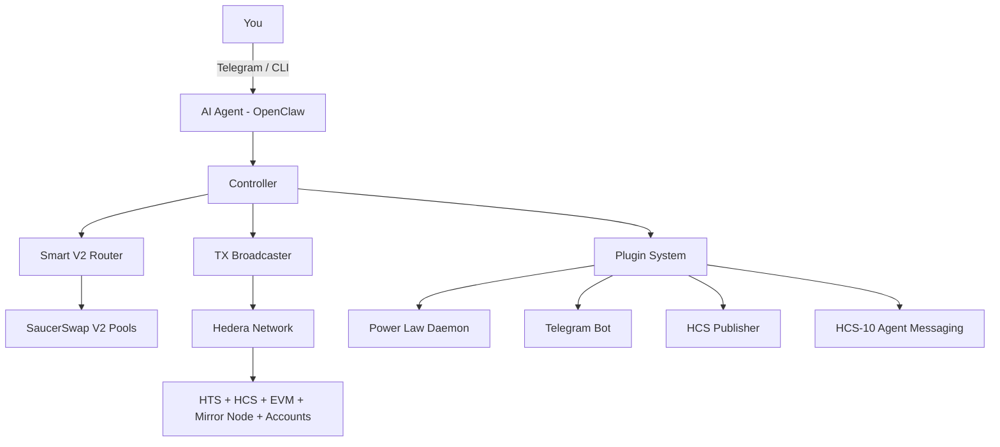

# Pacman -- Self-Custody AI Wallet for Hedera

**Your wallet. Your exchange. Your AI agent. Direct to blockchain.**

One conversation sets up your entire Hedera trading infrastructure. No logins, no SaaS, no custody risk. Just you, your agent, and the network.

---

[](https://hedera.com)
[](https://saucerswap.finance)
[](https://python.org)
[](LICENSE)
[](https://hedera.com)

---

## Why We Built This

Hedera is incredible -- 10,000 TPS, sub-second finality, fixed fees, enterprise governance. But getting started? That's still way too hard. Browser wallets, centralized exchanges, scattered tools... it doesn't have to be this way.

We believe compute is moving to the edge. Your wallet, your exchange, your entire financial infrastructure should live on YOUR machine, under YOUR control. Pacman makes that real -- a fully autonomous AI wallet agent that runs locally, trades on mainnet, and talks directly to Hedera. No middlemen. No monthly fees. Just open source code you can read, modify, and trust.

We built this because we want to see more people have access to Hedera. And we think making it as easy as chatting with an AI is the way to get there.

---

## Quick Start

```bash
git clone https://github.com/Chris0x88/pacman.git
cd pacman
./launch.sh init
```

That's it. The wizard handles everything -- key generation, token associations, health checks. Three commands to a working Hedera wallet.

```bash
./launch.sh balance               # See your portfolio
./launch.sh swap 5 USDC for HBAR  # Trade on SaucerSwap V2
./launch.sh dashboard             # Open the local web dashboard
```

---

## What You Get

### Talk to Hedera Through Telegram
Swap tokens, send transfers, check balances -- all from chat. Button-driven wizards handle common flows in under 200ms (no LLM round-trip). Natural language falls through to the AI agent for everything else. It's like having a personal DeFi assistant in your pocket.

### Autonomous Bitcoin Rebalancer
A Power Law daemon (Heartbeat V3.2) calculates optimal BTC allocation based on Bitcoin's 4-year price cycle and executes rebalancing swaps automatically. Set it and let it run. It broadcasts daily signals to HCS so anyone can subscribe.

### Smart V2 Routing (Built From Scratch)
Multi-hop swap routing across SaucerSwap V2 liquidity pools with three fee tiers, hub routing through USDC and HBAR, pool depth validation, and automatic HBAR/WHBAR conversion. This was built from scratch -- the first working multi-hop V2 implementation available to the Hedera community.

### HCS Signal Broadcasting + Agent Feedback
Daily Power Law signals published to Hedera Consensus Service. Plus a new cross-agent feedback system -- agents can post bugs, suggestions, and successes to a shared HCS topic. Every Pacman instance learns from the network.

### Plugin Architecture
Build your own strategies, tools, and daemons without touching core code. Ships with: Power Law rebalancer, Telegram bot, Discord bot, HCS publisher, HCS-10 agent messaging, and x402 micropayment server. Want to add a new strategy? Extend `BasePlugin` and drop it in `src/plugins/`.

### Multi-Account Isolation
Main account for user trading, robot account for autonomous operations. Each with independent ECDSA keys, separate EVM addresses, and isolated transaction histories. No shared-key vulnerabilities.

### Training Data Pipeline
Every command generates structured fine-tuning data -- SFT instruction pairs, DPO preference pairs, execution telemetry. 17 documented incidents feed the knowledge base. The long game: a model that has internalized operational wisdom from thousands of real interactions.

### Local Web Dashboard
Real-time portfolio monitoring, system health, and robot status. Served on localhost -- no cloud, no tracking, no third-party analytics.

---

## The Full Stack



### Hedera Services Used

| Service | How We Use It |
|---------|--------------|
| **HTS** | Token creation, association, transfers, ERC20 approvals via precompile |
| **HCS** | Signal broadcasting, cross-agent feedback, HCS-10 messaging |
| **EVM** | SaucerSwap V2 router/quoter, multicall, exact-in/exact-out swaps |
| **Mirror Node** | Balances, tx history, pool data, EVM alias resolution |
| **Accounts** | Multi-account management, independent ECDSA keys, nickname discovery |

### 30+ CLI Commands

Swaps, transfers, balances, staking, limit orders, NFT display, liquidity positions, pool management, HCS publishing, agent messaging, daemon control, health diagnostics, whitelist management, key backup, account creation... and more. Run `./launch.sh help` for the full list.

---

## Built to Last

21 bugs found and fixed in production with real money on the line. Every failure became a documented lesson. Every agent disaster became an anti-pattern. The codebase has institutional memory.

Safety is enforced through governance-first architecture -- all limits live in one file (`data/governance.json`): $100 max per swap, $100 daily, 5% slippage cap, 5 HBAR gas reserve. Transfer whitelists block everything not explicitly approved. See [SECURITY.md](SECURITY.md).

---

## Repository

```
src/              Core engine (controller, router, executor, plugins)
cli/              30+ command handlers
lib/              Integrations (SaucerSwap, Telegram, Discord, prices)
data/             Config, pools, governance, templates, ABIs
openclaw/         AI agent workspace (SKILL.md, persona, decision trees)
dashboard/        Local web monitoring
scripts/          Utilities and data harvesting
tests/            Test suites
```

---

## For Hackathon Judges

| Resource | Link |
|----------|------|
| Demo Video | [YouTube - TBD] |
| Pitch Deck | [`pitch_deck/Pacman_Pitch_Deck.pdf`](pitch_deck/Pacman_Pitch_Deck.pdf) |
| Live Bot | [@Chris0x88hederabot](https://t.me/Chris0x88hederabot) |
| HCS Signals | Topic `0.0.10371598` |

**Tracks**: AI & Agents, DeFi & Tokenization, OpenClaw Bounty

---

## Built With

[Hedera](https://hedera.com) | [SaucerSwap](https://saucerswap.finance) | [OpenClaw](https://openclaw.ai) | [Python](https://python.org) | [uv](https://docs.astral.sh/uv/) | [Web3.py](https://web3py.readthedocs.io) | [Flask](https://flask.palletsprojects.com)

---

## Contributing

Open source, MIT licensed. See [CONTRIBUTING.md](CONTRIBUTING.md) and [SECURITY.md](SECURITY.md).

---

## The Future

Every program can be self-custodied by you. Your wallet, your exchange, your chat system -- all running on your machine, all driven by AI agents, all settled on Hedera. No intermediaries, no permission required.

This is open source infrastructure for that future. Build on it.

---

```
Pacman v4.1.0 | Hedera Apex Hackathon 2026
Author: Christopher David Imgraben
Disclaimer: Experimental software. Use disposable keys. Not financial advice.
```
