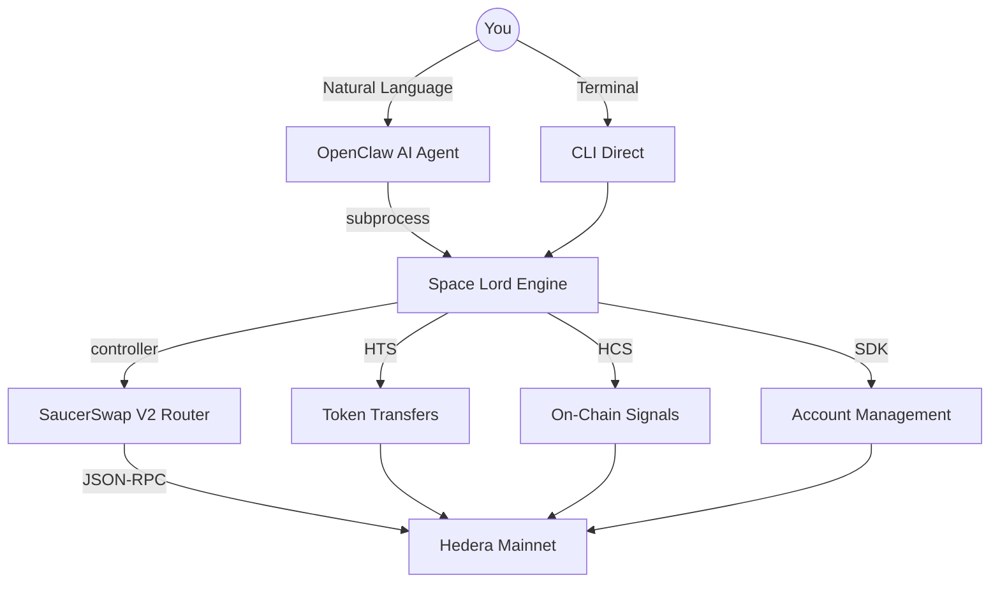

# Space Lord

**Open-source AI agent toolset for Hedera DeFi**

[](https://hedera.com)
[](https://hedera.com)
[](https://saucerswap.finance)
[](https://openclaw.ai)
[](https://python.org)
[](LICENSE)

> **Hedera Hello Future Apex Hackathon 2026** — AI & Agents Track | OpenClaw Bounty

---

## What is Space Lord?

Space Lord is open-source software you download and run on your own machine. It brings the exchange, the wallet, and the post office onto your local device — so you or your AI agent can interact with Hedera DeFi directly, with your own keys, through natural language.

No browser wallet. No exchange login. No click fatigue. No cognitive load. No multi-app juggling.

One local tool. 30+ commands. Direct to smart contracts.

### The origin: Project Pacman

Space Lord is built from **Project Pacman** — a baby-steps experiment into edge compute. The original codename was literal: an experiment in "eating the middleware" between users and the Hedera blockchain. The goal was to collapse everything — the exchange, the wallet, the portfolio tracker, the block explorer — into software that runs on your own device.

This is Phase 1 of a larger vision: collapsing DeFi software into either the Hashgraph itself, or local edge compute devices. The app is still a bit clunky, but it works — with real money, on Hedera mainnet.

---

## Quick Start

### Option A: From your OpenClaw Agent

We are heading to a multi-agent universe. The Space Lord skill is **ONLY A SUPPORT TOOL** that provides agentic control of the application (which itself gets installed in Option B).

However, your primary [OpenClaw](https://openclaw.ai) agent can drive to this GitHub repo, download the app for itself, and create a second, dedicated OpenClaw Agent equipped with the Space Lord skill package. These are early features on OpenClaw, but they are powerful.

1. Ask your OpenClaw agent to `git clone` this repository and install the application locally.
2. Have the agent spin up a new, dedicated trading agent using the Space Lord skill.
3. **Set up a communication channel.** You will need to create your own Telegram bot so you can chat directly with your new OpenClaw agent. While OpenClaw can guide you to set up channels through Discord or other platforms, we have optimized the Space Lord experience on Telegram for our proof of concept and its strong demonstration capabilities.

### Option B: Manually From your Terminal (Mac/Linux)

This is where a user installs the application manually themselves. **It is best to run this locally on your computer so you are not passing crypto keys to your agent through the AI LLM chat API (which is unsafe and would send your keys to future model training data)**. New key features are coming soon to protect you further... For now, treat our software as live network "experimental." Set it up once, properly, through the Terminal interface / CLI:

```bash
git clone https://github.com/Chris0x88/pacman.git
cd pacman
./launch.sh init        # Guided wizard: key setup, token associations
./launch.sh help        # See all 30+ available commands
./launch.sh balance     # Check your portfolio
./launch.sh swap 10 USDC for HBAR --yes   # Execute a real swap
```

`./launch.sh` is a zero-dependency bash launcher. It installs `uv` (Python package manager) on first run, validates your `.env` exists, and dispatches to the CLI engine. Your private keys are entered locally through the wizard — they never travel through any API.


## Architecture



### The pieces

| Component | What it does | Where it lives |
|-----------|-------------|----------------|
| **CLI Engine** | The algorithmic heart. 30+ deterministic commands. controller → router → executor pipeline. | `cli/main.py`, `src/controller.py`, `src/router.py`, `src/executor.py` |
| **SaucerSwap V2 Router** | Our custom, open-source multi-hop path finding across V2 liquidity pools. Direct smart contract calls via JSON-RPC (Web3.py → hashio.io). *Note: Our OpenClaw agent supersedes the need for fixed routing algorithms, especially at low speed.* | `src/router.py`, `lib/saucerswap.py` |
| **Governance Engine** | Safety limits enforced at runtime. Per-swap max, daily max, slippage cap, gas reserve. Single source of truth. | `data/governance.json` → `src/config.py` |
| **OpenClaw Agent** | AI agent reads SKILL.md, interprets natural language, executes CLI commands as subprocesses. Includes light skill protection to prevent exploring keys/config unless debugging, as our main goal was to prevent agents from reading keys on every action (full sandbox isolation is planned). OpenClaw also highlights the utility of direct tool use over MCP. We were forced down this path due to MCP's setup complexity for small modular systems, although it remains great for big corporate setups. | `openclaw/`, `SKILL.md` |
| **Power Law Rebalancer** | Autonomous daemon and proof of concept for local portfolio control via fixed-code, schedule-based rebalancing. Computes BTC allocation using the Power Law model and auto-rebalances on thresholds. *Note: Built as a fast, local solution while waiting for Hedera Schedule Service and Blockstreams, though these features will eventually morph into the native Hedera network.* | `src/plugins/power_law/` |
| **HCS Signal Publisher** | Serves two purposes on the Hedera Consensus Service: (1) Logging bugs and app utility issues so the application can self-heal and improve from the swarm of users. (2) Broadcasting trading signals (via the HCS-10 protocol for agent-to-agent messaging) for potential monetization. | `src/plugins/hcs_manager.py`, `src/plugins/hcs10/` |
| **Training Data Pipeline** | Automatically records every agent-driven CLI command and the app's exact technical responses. It formats this telemetry into 'instruction pairs'—specialized datasets used to train (fine-tune) future AI models so they can natively master the Space Lord ecosystem over time. *Note: If we find a clean, privacy-preserving way to safely capture raw OpenClaw chats, we aim to incorporate that data too, with the ultimate goal of replacing this entire software stack with simple AI tools.* | `src/agent_log.py`, `scripts/harvest_knowledge.py` |

### The interfaces

| Interface | Speed | Best for |
|-----------|-------|----------|
| **OpenClaw Agent** (Telegram) | ~2-5s (includes LLM reasoning) | Complex multi-step operations, portfolio analysis, natural conversation. Drives your local software stack and CLI for you, preventing the need to remember commands or manually wait through multi-step processes. |
| **Terminal CLI** | Instant | Scripting, automation, direct control, debugging |
| **Dashboard** | Real-time | Visual portfolio overview (monitoring only). *Note: Expected to be replaced by OpenClaw's upcoming "canvas" feature, which will generate user interfaces on the fly.* |

---

## Hedera Integration

Space Lord uses 5+ Hedera services directly — not through any middleware:

| Service | How Space Lord uses it |
|---------|----------------------|
| **SaucerSwap V2 (EVM Smart Contracts)** | Direct router/quoter calls via JSON-RPC. Multi-hop path finding across V2 pools. No exchange API. |
| **Hedera Token Service (HTS)** | Token associations, transfers, approvals via HTS Precompile. Dual approval system (EVM + HTS) for SaucerSwap. |
| **Hedera Consensus Service (HCS)** | Daily Power Law signal broadcast. Walled garden topics with submit_key control. HCS-10 agent-to-agent messaging. |
| **Mirror Node REST API** | Real-time balances, transaction history, public key lookups, ECDSA alias derivation. |
| **Hedera Accounts** | Multi-account management (main + robot). Account creation via Hiero SDK. ECDSA key signing. |
| **Staking** | HBAR staking/unstaking to consensus nodes. |

---

## Features

Space Lord ships with 30+ CLI commands across these categories:

### Core Trading
Swap tokens directly through SaucerSwap V2 smart contracts. Natural language parsing ("swap 10 USDC for HBAR") or explicit commands. Multi-hop routing with automatic fee-tier selection. This is the foundation that enables users to set up their own limit orders and index fund strategies locally — we've built fixed examples (Power Law BTC rebalancer, limit order triggers), and a general-purpose strategy builder is on the roadmap.

### Portfolio Management
Real-time balances with USD values across all accounts. Transaction history. Token registry. NFT viewer. All data pulled directly from Hedera Mirror Node.

### Self-Custody Transfers
Send tokens to whitelisted destinations only. Wallet whitelists are the primary safety feature — every transfer requires a pre-approved recipient. EVM addresses are blocked; only Hedera account IDs (0.0.xxx format).

### Autonomous Rebalancer
The Power Law plugin runs as a daemon. It calculates optimal BTC allocation based on the Bitcoin Power Law model, monitors portfolio drift, and auto-rebalances when deviation exceeds the configured threshold. Publishes daily signals to HCS.

### On-Chain Signals (HCS)
Daily Power Law heartbeat broadcast to a Hedera Consensus Service topic. Structured JSON signals (allocation percentage, stance, phase, portfolio state). Anyone can subscribe via Mirror Node. HCS-10 protocol enables agent-to-agent messaging.

### Governance & Safety
All safety limits live in one file: `data/governance.json`. Per-swap max ($100), daily max ($100), max slippage (5%), minimum HBAR gas reserve (5 HBAR). The AI agent cannot modify these — only the user can.

### Training Data Pipeline
Every command execution auto-generates structured fine-tuning data: SFT instruction pairs, execution telemetry, and DPO preference pairs from documented incidents. 11 anti-patterns documented from real agent sessions. The long-term vision: fine-tune an LLM that doesn't just use Space Lord — it becomes Space Lord.

---

## Security Model

The golden rule: **the AI agent never sees your keys.**

- Private keys stored locally in `.env`, encrypted in memory via SecureString (XOR obfuscation), decrypted only at the moment of transaction signing, then immediately cleared
- The agent predicts *intent*. The deterministic CLI handles the *cryptography*.
- Wallet whitelists enforce all outbound transfers — no exceptions
- Governance engine is read-only to the agent (user-configurable, not agent-modifiable)
- We never simulate — every transaction is real. Simulations hide bugs.

---

## Hackathon Resources

| Resource | Link |
|----------|------|
| Demo Video | [YouTube link in submission] |
| Pitch Deck | [`pitch_deck/`](pitch_deck/) |
| Technical Whitepaper | [`docs/WHITEPAPER.md`](docs/WHITEPAPER.md) |
| ClawHub Skill | [https://clawhub.ai/Chris0x88/pacman-hedera](https://clawhub.ai/Chris0x88/pacman-hedera) |
| HCS Signal Topic | `0.0.10371598` |

---

## Project Structure

```
launch.sh                   # Zero-dependency entry point
cli/main.py                 # CLI dispatcher (30+ commands)
cli/commands/               # Command handlers
src/controller.py           # Main orchestrator
src/router.py               # SaucerSwap V2 path finding
src/executor.py             # Transaction execution
src/config.py               # Runtime config (loads from governance.json)
lib/transfers.py            # Token transfers + ECDSA resolution
lib/saucerswap.py           # SaucerSwap V2 client
lib/tg_router.py            # Shared Telegram routing
lib/tg_format.py            # Shared HTML formatting
src/plugins/power_law/      # Autonomous BTC rebalancer
src/plugins/hcs_manager.py  # HCS topic management
src/plugins/hcs10/          # Agent-to-agent messaging
src/plugins/discord_bot/    # Discord bot
data/governance.json        # Safety limits (SINGLE SOURCE OF TRUTH)
data/pools_v2.json          # SaucerSwap V2 pool registry
openclaw/                   # Agent workspace (only thing the agent sees)
SKILL.md                    # Agent brain
docs/WHITEPAPER.md          # Technical deep dive
```

---

## Tech Stack

| Layer | Technology |
|-------|-----------|
| Language | Python 3.10+ |
| Package Manager | uv |
| Hedera SDK | hiero-sdk-python |
| Smart Contracts | Web3.py → JSON-RPC (hashio.io) |
| DEX | SaucerSwap V2 (Quoter + Router contracts) |
| HTTP | httpx (async) |
| Data | pandas, numpy |
| Bots | discord.py, Telegram Bot API |
| Dashboard | Flask + FastAPI |
| Charts | matplotlib, cairosvg |
| AI Agent | OpenClaw (TypeScript, SKILL.md plugin) |

---

## License

MIT

---

*Built with real money. Real transactions. Real learnings.*
