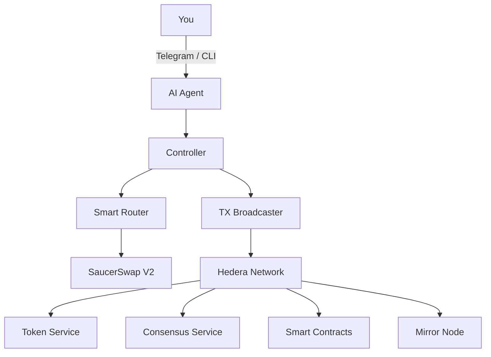

# Pacman -- Self-Custody AI Wallet for Hedera

**Your wallet. Your exchange. Your AI agent. Direct to blockchain.**

No logins. No SaaS. No custody risk. Just you, your agent, and Hedera.

---

[](https://hedera.com)
[](https://saucerswap.finance)
[](https://python.org)
[](LICENSE)
[](https://hedera.com)

---

## The Vision

Hedera is one of the most powerful public networks ever built -- 10,000 transactions per second, sub-second finality, fixed low fees, a governing council of the world's largest enterprises. Yet its user base remains small. Why? Because the tooling to actually use it is still locked behind browser wallets, centralized exchanges, and SaaS platforms that defeat the purpose of decentralization.

What if one conversation with an AI agent could set up your entire trading infrastructure? Not a custodial app that holds your keys. Not a SaaS dashboard that charges monthly fees. A local program, running on your machine, with your private keys, talking directly to the Hedera network. Your wallet, your exchange, your rebalancing daemon, your signal publisher -- all self-custodied, all under your control, all driven by natural language.

As compute moves to the edge, the logical endpoint is clear: every program can be self-custodied by you. Your bank, your exchange, your chat system -- no intermediary required. Pacman is built on this conviction. It is a fully autonomous AI wallet agent that runs locally, trades on mainnet via SaucerSwap V2, publishes signals to Hedera Consensus Service, and operates a quantitative Bitcoin rebalancing daemon. One developer, five weeks, 28,000 lines of Python, 21 bugs found and fixed in production with real money on the line. We built this because we want to see more people have access to Hedera.

---

## What Pacman Does

- **Conversational DeFi via Telegram** -- Swap tokens, send transfers, check balances, manage your portfolio -- all through chat. Button-driven wizards for zero-typing workflows. Natural language for everything else.

- **Autonomous Bitcoin Rebalancing** -- A Power Law model daemon (Heartbeat V3.2) that calculates optimal BTC allocation based on Bitcoin's 4-year price cycle and executes rebalancing swaps autonomously.

- **HCS Signal Broadcasting** -- Daily Power Law trading signals published to Hedera Consensus Service. A micropayment subscription model for real-time market data (~$10/year in HBAR).

- **Multi-Account Isolation** -- Main account for user trading, robot account for autonomous operations. Each with independent ECDSA keys and separate EVM addresses. No shared-key vulnerabilities.

- **Plugin Architecture** -- Build your own strategies, tools, and daemons without touching core code. Power Law, Telegram, HCS, HCS-10 agent messaging, and x402 micropayments ship as plugins.

- **Local Web Dashboard** -- Real-time portfolio monitoring, system health, and robot status served on localhost. No cloud, no tracking, no third-party analytics.

- **Training Data Pipeline** -- Every command execution generates structured fine-tuning data (SFT instruction pairs, DPO preference pairs, execution telemetry). The long game: a model that has internalized operational wisdom from thousands of real interactions.

- **Zero External Dependencies** -- Runs on any machine with Python 3.10+. The launcher handles everything via [uv](https://docs.astral.sh/uv/). No Docker, no Node.js, no system packages.

---

## Quick Start

```bash
git clone https://github.com/Chris0x88/pacman.git
cd pacman
./launch.sh init
```

The init wizard creates your `.env` configuration, walks you through key setup (generate new or paste existing), associates core tokens, and runs a health check. From there:

```bash
./launch.sh doctor            # System health check (6 categories)
./launch.sh balance           # Token balances with USD values
./launch.sh swap 5 USDC for HBAR   # Execute a live swap on SaucerSwap V2
```

Works on macOS (Apple Silicon and Intel), Linux, and Windows via WSL2.

---

## Architecture



Three interfaces, one core:

- **CLI** -- 30+ commands, natural language parsing, structured JSON output. The substrate everything else builds on.
- **OpenClaw Agent** -- A 1,200-line persona document (SKILL.md) turns the CLI into a conversational DeFi operator. Users say "what's my balance?" and get a formatted portfolio card. They never see a terminal command.
- **Telegram Bot** -- Button-driven swap and send wizards that bypass the LLM entirely for deterministic operations (<200ms execution). Natural language falls through to the AI agent when needed.

The core trading engine: `controller.py` (facade) routes through `router.py` (cost-aware graph pathfinding across V2 liquidity pools) to `executor.py` (Web3 transaction broadcaster with automatic token approval and HBAR wrapping).

---

## Hedera Integration Depth

| Service | What We Use It For |
|---------|-------------------|
| **HTS (Token Service)** | Token creation, association, transfers, ERC20 approvals via HTS precompile |
| **HCS (Consensus Service)** | Signal broadcasting (Power Law heartbeats), HCS-10 agent-to-agent messaging |
| **EVM (Smart Contracts)** | SaucerSwap V2 router, quoter, multicall swaps, exact-in/exact-out execution |
| **Mirror Node** | Balance queries, transaction history, pool liquidity data, EVM address resolution |
| **Accounts** | Multi-account management with independent ECDSA keys, nickname-based discovery |

The SaucerSwap V2 integration was built from scratch -- the existing documentation was incomplete and EVM contract interactions were undocumented. Pacman is the first working multi-hop swap implementation available to the Hedera community. The router handles three fee tiers, hub routing through USDC and HBAR, pool depth validation, blacklisted pair enforcement, and transparent HBAR/WHBAR conversion.

---

## Battle-Tested

This is not a prototype. Real HBAR, USDC, and WBTC have been traded through this system. Real bugs have cost real gas. Real agent sessions have gone catastrophically wrong and been documented, analyzed, and turned into anti-patterns that live in the codebase as training data.

**21 bugs found and fixed in production**, including:

- **USDC dual-variant resolution** (BUG-021) -- Hedera has two USDC tokens. The system silently detects which variant the user holds and routes accordingly.
- **Double-tap replay prevention** (BUG-019) -- Deduplication cache prevents duplicate on-chain transactions from button double-taps or Telegram callback re-delivery.
- **Stale callback drain** (BUG-020) -- On bot restart, all pending Telegram updates are acknowledged and discarded before dispatch begins.
- **Token approval no-op** (BUG-016) -- A `pass` statement where an approval call should have been. Silently failing since day one, masked by pre-approved tokens.

Every bug became a documented lesson. Every agent failure became an anti-pattern. The codebase has institutional memory.

Safety is enforced through a governance-first architecture. All limits live in a single file (`data/governance.json`): $100 max per swap, $100 daily volume, 5% max slippage, 5 HBAR minimum gas reserve. Transfer whitelists block all outbound transfers to non-approved addresses. EVM addresses are rejected entirely -- only Hedera IDs accepted. See [SECURITY.md](SECURITY.md) for the full security model.

---

## Repository Structure

```
cli/              Command handlers (30+ commands)
src/              Core trading engine (controller, router, executor)
lib/              External integrations (SaucerSwap, Telegram, prices, transfers)
data/             Configuration, pool registries, governance limits
openclaw/         AI agent workspace (SKILL.md, persona, decision trees)
src/plugins/      Plugin system (Power Law, Telegram, HCS, HCS-10, x402)
dashboard/        Local web monitoring (served on :8088)
scripts/          Utilities, data harvesting, pool refresh
tests/            Test suites
abi/              Smart contract ABIs (SaucerSwap, ERC20, Multicall)
pitch_deck/       Hackathon presentation
```

---

## For Hackathon Judges

**Event**: Hedera Hello Future Apex Hackathon 2026

| Resource | Link |
|----------|------|
| Demo Video | [YouTube - TBD] |
| Pitch Deck | [`pitch_deck/Pacman_Pitch_Deck.pdf`](pitch_deck/Pacman_Pitch_Deck.pdf) |
| Live Bot | [@Chris0x88hederabot on Telegram](https://t.me/Chris0x88hederabot) |
| HCS Signal Topic | `0.0.10371598` |
| Repository | [github.com/Chris0x88/pacman](https://github.com/Chris0x88/pacman) |

**Tracks**:
- **AI & Agents** -- Autonomous AI agent driving real DeFi operations on Hedera
- **DeFi & Tokenization** -- First working V2 multi-hop swap CLI, HCS signal marketplace
- **OpenClaw Bounty** -- Agent-native application with SKILL.md persona, proactive intelligence, multi-account awareness

---

## Built With

- **[Hedera Hashgraph](https://hedera.com)** -- HTS, HCS, EVM, Mirror Node, Accounts
- **[SaucerSwap](https://saucerswap.finance)** -- V2 DEX (primary), V1 (legacy)
- **[OpenClaw](https://openclaw.ai)** -- AI agent orchestration
- **[Python 3.10+](https://python.org)** -- Core language
- **[uv](https://docs.astral.sh/uv/)** -- Zero-dependency package management
- **[Web3.py](https://web3py.readthedocs.io)** -- EVM smart contract interaction
- **[Flask](https://flask.palletsprojects.com)** -- Dashboard REST API
- **[MoonPay](https://moonpay.com)** -- Fiat onramp (user-initiated only)

---

## Contributing

Open source under the [MIT License](LICENSE). Contributions welcome.

```bash
git clone https://github.com/Chris0x88/pacman.git
cd pacman
cp .env.template .env       # Add your Hedera testnet key
./launch.sh doctor           # Verify system health
./launch.sh help             # See all commands
```

See [SECURITY.md](SECURITY.md) for security policies and responsible disclosure.

---

## License

MIT License. See [LICENSE](LICENSE) for details.

---

## The Future

The training data pipeline is the long game. Every command, every swap, every error, every agent interaction is recorded in structured formats for model fine-tuning. The end state: a model that does not need a 1,200-line instruction document because it has internalized the operational wisdom from thousands of real interactions. An agent that is the app, not an agent that drives the app.

But the principle is bigger than one project. Self-custody is not just a crypto talking point -- it is the natural architecture for an age of human agency. When compute lives at the edge, when AI agents can operate complex infrastructure on your behalf, the question becomes: why would you hand your keys to anyone else? Every program can be self-custodied by you. Pacman is open source infrastructure for that future.

---

```
Pacman v4.0.0 | Hedera Apex Hackathon 2026
Author: Christopher David Imgraben
Disclaimer: Experimental software. Use disposable keys. Not a regulated financial service.
```
