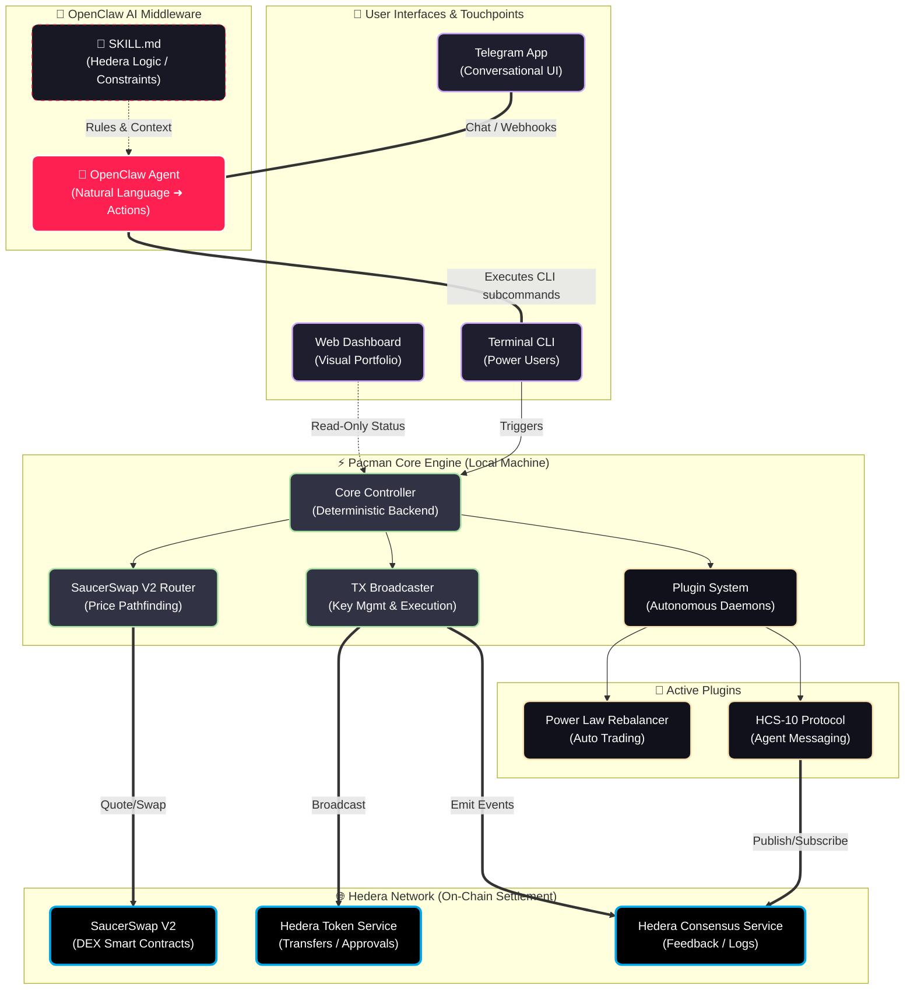

# SPACE LORD — TECHNICAL WHITEPAPER & ARCHITECTURE

*This document contains the deep technical details, design philosophy, security model, and CLI documentation for Space Lord (Project Pacman), the open-source AI agent toolset for Hedera DeFi. For a high-level overview, see the main `README.md`.*

---

## How It Works

Four ways to interact with Pacman — all driving the same core engine, all settling on Hedera:



| Interface | What It Does | Status |
|-----------|-------------|--------|
| **OpenClaw Agent** | Natural language wallet — swap, send, check balances, manage portfolio via chat. Reads `SKILL.md` for decision-making. Drives the CLI for you so you don't need to remember commands or wait through multi-step processes. | Live |
| **Telegram** | Conversational interface to the OpenClaw agent. Users set up their own Telegram bot to chat directly with their dedicated agent. | Live |
| **CLI** | The deterministic command layer. 30+ commands that both humans and AI agents operate identically. | Live |
| **Dashboard** | Local web UI for portfolio monitoring (read-only). Expected to be replaced by OpenClaw's upcoming "canvas" feature, which will generate user interfaces on the fly. | Live (view-only) |

### Why Tool Use Over MCP

OpenClaw highlights the utility of **direct tool use over MCP** (Model Context Protocol). We were forced down this path due to MCP's setup complexity for small modular systems. While MCP is excellent for large corporate integrations, it introduces unnecessary overhead for a lightweight, self-contained agent skill like Space Lord. Direct subprocess execution via `SKILL.md` is simpler, faster, and keeps the agent's footprint minimal.

### Key Protection Philosophy

Our main goal was to **prevent agents from reading keys on every action**. As the code stands, the agent could search for keys and config files, but it has no need to unless explicitly debugging or rebuilding the codebase. The skill includes light protection to prevent this "adventurism" unless directed. Full sandbox isolation for key files is a planned future feature — for now, treat the software as live network "experimental."

> ⚠️ **Important:** Do not pass crypto keys to your agent through the AI LLM chat API. This is unsafe and could send your keys to future model training data. Always install and configure Space Lord manually via the Terminal CLI (Option B in the README).

---

## Technical Features Deep-Dive

### Talk to Hedera Through OpenClaw (Telegram)
| Capability | How |
|-----------|-----|
| Swap tokens | `swap 10 HBAR for USDC` — natural language or button wizards |
| Send transfers | `send 50 USDC to 0.0.xxx` — whitelisted destinations only |
| Check portfolio | `balance` — all holdings with live USD values |
| Set limit orders | `order buy HBAR at 0.08 size 100` — background daemon |
| Stake HBAR | `stake` — to consensus nodes |
| Manage liquidity | `lp` — V2 pool positions |

### Direct SaucerSwap V2 Integration
We built a **custom, open-source** connection to SaucerSwap V2 from scratch — the first available to the Hedera community. Note: Our OpenClaw agent supersedes the need for fixed routing algorithms, especially at low speed — the AI can reason about routes dynamically rather than relying on hardcoded path-finding logic.

| Capability | Detail |
|-----------|--------|
| Token types | HTS tokens, native HBAR, EVM tokens — swaps across all of them |
| Fee tiers | Three V2 fee tiers with automatic selection |
| Hub routing | Routes through USDC and HBAR liquidity hubs |
| HBAR/WHBAR | Automatic wrapping/unwrapping (WHBAR is never user-facing) |
| Pool validation | Depth checks before execution, stale data detection |

### HCS Agent Feedback System
The HCS integration serves **two distinct purposes**:

1. **Self-healing telemetry:** Every Space Lord instance can post bugs, suggestions, and app utility issues directly to a shared HCS topic — no GitHub account required. This creates a crowd-sourced improvement loop: the swarm of users generates bug reports, reports get timestamped on-chain, and developers (or coding agents) pick them up and push fixes. The application self-heals from its user base.

2. **Trading signal broadcast:** Daily Power Law signals are broadcast to HCS for potential monetization. Structured JSON signals (allocation percentage, stance, phase, portfolio state) — anyone can subscribe via Mirror Node. HCS-10 protocol enables agent-to-agent messaging.

### Plugin Architecture
Build your own strategies, tools, and daemons without touching core wallet code. Extend `BasePlugin`, drop it in `src/plugins/`, and you have direct blockchain access.

| Plugin | What It Does |
|--------|-------------|
| Power Law Rebalancer | Autonomous BTC/USDC rebalancing daemon. Proof of concept for local portfolio control via fixed-code, schedule-based rebalancing. Built as a fast local solution while waiting for Hedera Schedule Service and Blockstreams — these features will eventually morph into native Hedera network execution. |
| HCS Publisher | Daily signal broadcasting to Consensus Service |
| HCS-10 | Cross-agent communication protocol |
| Discord Bot | Portfolio monitoring via Discord |
| Limit Order Engine | Background price polling and passive swap execution |

### Training Data Pipeline
Every agent-driven CLI command and the app's exact technical response is automatically recorded and formatted into 'instruction pairs' — specialized datasets used to train (fine-tune) future AI models so they can natively master the Space Lord ecosystem over time.

- `agent_interactions.jsonl`: Raw operational log (command, output, timing, errors)
- `instruction_pairs.jsonl`: OpenAI-compatible SFT pairs
- `live_executions.jsonl`: Detailed tx telemetry (gas, rates, hashes, routes)

> **Future vision:** If we find a clean, privacy-preserving way to safely capture raw OpenClaw chats (not just CLI commands), we aim to incorporate that data too — with the ultimate goal of replacing this entire software stack with simple AI tools. The long-term vision: fine-tune an LLM that doesn't just *use* Space Lord — it *becomes* Space Lord.

---

## Security Model

The key design decision: **your private keys never touch an AI API.**

The agent runs commands — it doesn't see your keys, it doesn't read the plumbing, it doesn't know how transactions are constructed. It selects an action (`swap 5 HBAR for USDC`), the CLI executes it deterministically, and returns the result. Software handles the crypto. AI handles the intent.

| Layer | How It Works |
|-------|-------------|
| **Key isolation** | Keys live in `.env` on your machine. XOR-obfuscated in memory. Never transmitted. |
| **Deterministic execution** | Every command produces the same result for the same input. No probabilistic failures. |
| **Transfer whitelists** | All outbound transfers blocked unless destination is explicitly approved. EVM addresses blocked entirely. |
| **Safety limits** | `governance.json` enforces: $100 max per swap, $100 daily, 5% slippage cap, 5 HBAR gas reserve. |
| **Agent guardrails** | Agent can't modify its own limits, can't bypass whitelists, can't access keys. |

---

## Hedera Services Used

| Service | How We Use It |
|---------|--------------|
| **HTS** | Token creation, association, transfers, ERC20 approvals via precompile |
| **HCS** | Signal broadcasting, cross-agent feedback (HCS-10), timestamped messaging |
| **EVM** | SaucerSwap V2 router/quoter, multicall, exact-in/exact-out swaps |
| **Mirror Node** | Balances, tx history, pool data, EVM alias resolution, NFT metadata |
| **Accounts** | Multi-account management, independent ECDSA keys, nickname discovery |

---

## CLI Commands

The CLI is the deterministic command layer that both humans and AI agents operate. Every function the agent can perform, you can run directly. 

```
TRADING        swap, swap-v1, price, slippage
PORTFOLIO      balance, status, history, tokens, nfts
TRANSFERS      send, receive, whitelist
ACCOUNT        account, associate, setup, fund, backup-keys
STAKING        stake, unstake
LIQUIDITY      lp, pool-deposit, pool-withdraw, pools
LIMIT ORDERS   order buy/sell/list/cancel/on/off
ROBOT          robot signal/status/start/stop
MESSAGING      hcs, hcs10, feedback
SYSTEM         doctor, refresh, logs, docs, help
```

Run `./launch.sh help` for the full list.

---

## Repository Structure

```
cli/              Command handlers (30+ commands, modular sub-commands)
  commands/       Swap, balance, orders, wallet, staking, HCS, NFTs, etc.
src/              Core engine
  controller.py   SDK facade — the only thing CLI talks to
  router.py       V2 pathfinding with cost-aware hub routing
  executor.py     Transaction broadcaster (swaps, approvals, transfers)
  plugins/        Plugin system (Power Law, Telegram, HCS, Discord, etc.)
lib/              Integrations (SaucerSwap, Telegram, Discord, prices)
data/             Config, pools, governance, tokens, ABIs
openclaw/         AI agent workspace (SKILL.md, persona, decision trees)
dashboard/        Local web monitoring (read-only)
scripts/          Utilities, data harvesting, pool refresh
tests/            Test suites
```
