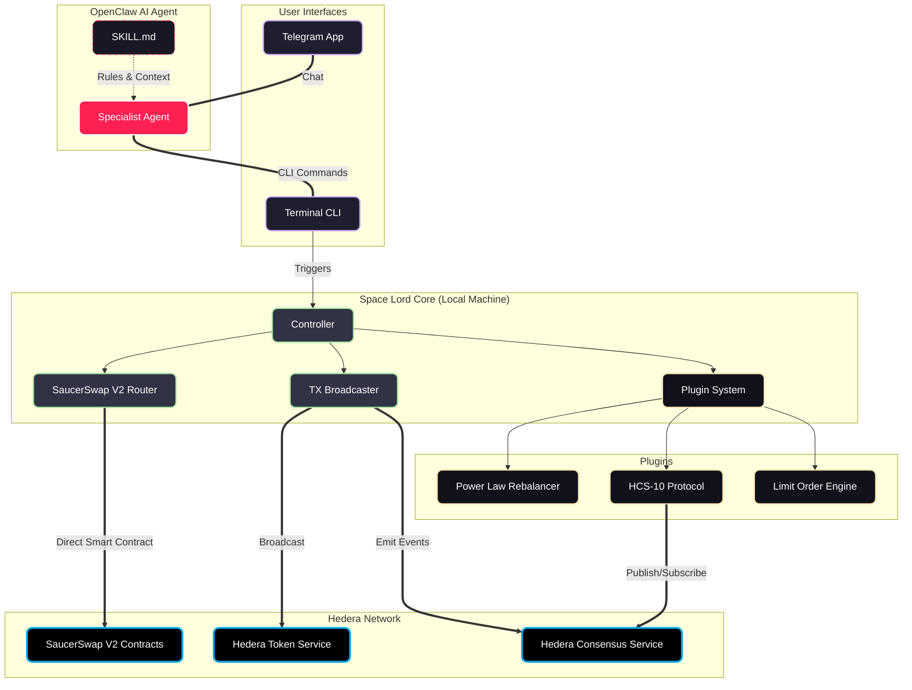

# SPACE LORD — WHITEPAPER

**The Connective Tissue Between AI Agents and Hedera**

*Open-source. Edge-compute. Agent as a Service.*

github.com/Chris0x88/pacman

---

## Abstract

Space Lord is a full-stack, open-source application that puts an AI agent in charge of your entire engagement with the Hedera hashgraph. It collapses the exchange, the wallet, and the portfolio tracker into one local tool — driven by a specialist OpenClaw AI agent through CLI tool use.

No clicks. No logins. No switching between apps. No middleware. Your agent, your CLI, your machine.

This is not a library. It is not an SDK. It is a complete, governed, locally-owned application that an AI agent drives end-to-end — running on Hedera mainnet today with real tokens. We believe it is one of the earliest edge-compute Agent as a Service (AGaaS) business models in the blockchain space.

---

## The Problem

Using Hedera DeFi today requires navigating a fragmented stack of middleware: wallet apps, exchange interfaces, browser extensions, approval flows, API redirections, and multi-step login processes. Each application in the chain takes a clip, restricts how you operate, and adds cognitive load.

A single token swap on SaucerSwap through HashPack requires: opening the wallet, authenticating, navigating to the exchange, connecting the dApp, selecting tokens, approving the transaction, confirming, and waiting. If you forgot why you were there by step five, you are not alone.

Meanwhile, AI agents are becoming capable enough to manage these workflows — but they lack governed, locally-owned software infrastructure to drive. Most agent toolkits give developers building blocks. Nobody is building the application layer that an agent actually operates.

---

## The Thesis

> *"Every SaaS company will become an AGaaS company — an Agent as a Service company."*
> — Jensen Huang, CEO, NVIDIA

Companies in the DeFi middleware layer are going to get split. They will either be **blockchain-native and building** — deploying smart contracts, providing liquidity, creating algorithms — or they will be **agentic and customer-facing** — building tooling and interfaces that users (human or AI) engage with. Everything in between is disappearing.

Space Lord is built on this thesis. We consume the middleware. We pull everything out of the intermediary software — starting with HashPack and SaucerSwap — and bring it onto your local device. You communicate directly with the Hedera network through your own AI agent. No wallet app. No exchange UI. Just your agent, your CLI, your machine.

We are one of the earliest edge-compute AGaaS business models: you own the software, you own the keys, and your agent runs locally. The middleware is being peeled away. We didn't know this business model had a name. We just built it.

---

## Architecture

### Three Platforms, One Agent

Space Lord connects Hedera's DeFi infrastructure to your Telegram through an OpenClaw AI agent. Three platforms, one agent.

```
You (Telegram) → OpenClaw Agent → Space Lord CLI → Hedera Network
```

**You Speak** → **Agent Interprets** → **CLI Executes** → **Hedera Settles**

The user speaks natural language through Telegram. The OpenClaw agent interprets the intent and maps it to a CLI command. The CLI executes deterministic code directly against the Hedera network — no middleware, no cloud, no proxy. Hedera settles the transaction. The result flows back to Telegram.

The agent is a user of the CLI — not an admin. It runs the exact same commands a human would. Same governance. Same whitelists. Same limits. This is the security model.

### The OpenClaw Specialist Agent Model

OpenClaw lets you run multiple agents, each with their own skills, config, and memory. Their own soul. Space Lord is deployed as a **specialist agent** you add to your existing OpenClaw system. It reads a structured `SKILL.md` file that defines its Hedera knowledge, decision-making rules, and operational constraints.

Your existing OpenClaw agent can go to our GitHub repo, download our tooling, and set up a secondary specialist agent for you — pre-configured to drive Hedera operations, with its own Telegram chat. The onboarding friction is near-zero for anyone already running OpenClaw.

### Why CLI Tool Use Over MCP

This was the big breakthrough with OpenClaw — you don't need MCP servers. You give your agent a terminal and it calls tools. MCP is excellent for large corporate integrations with fixed data pipelines, but it introduces unnecessary overhead for a lightweight, self-contained agent skill. Docker containers consume significant compute on small devices. CLI tool use via `SKILL.md` is simpler, faster, and keeps the agent's footprint minimal.

We were forced down this path by MCP's setup complexity — and it turned out to be a better architecture for edge compute. Direct subprocess execution means no server processes, no container orchestration, no port management. Just a terminal and a skill file.

### Fixed Code, Not Guesswork

Your agent doesn't write swap code. It doesn't generate transaction logic. It doesn't reinvent workflows on every call. It calls a fixed function every time — one valid execution path per operation. This means:

- **Fewer tokens consumed** — the agent isn't reasoning through code generation
- **Consistent results** — same input, same output, every time
- **Deterministic security** — governance enforcement happens in fixed code, not probabilistic AI
- **Agent focus shifts to workflows** — the agent masters multi-step operations, sequencing, and user interaction instead of reinventing plumbing

The AI model acts as a translation layer. You speak natural language, and the agent maps it perfectly to the CLI's fixed, secure inputs.

---

## What Makes Space Lord Different

### Space Lord vs Hedera Agent Kit

The [Hedera Agent Kit](https://github.com/hashgraph/hedera-agent-kit-js) is an excellent SDK that gives developers building blocks for Hedera — token operations, account management, consensus messaging. Space Lord is a different layer: a full-stack application that an AI agent drives end-to-end. They are complementary, not competing.

|  | Hedera Agent Kit | Space Lord |
|--|-----------------|------------|
| **What it is** | SDK / library for developers | Complete application an agent drives |
| **Who uses it** | Developers building custom agents | End users + AI agents directly |
| **Target market** | Developers | AI agents |
| **Agent framework** | LangChain, ElizaOS, MCP | OpenClaw CLI tool use (no MCP) |
| **Execution model** | API calls from code | Local CLI commands from terminal |
| **SaucerSwap** | Plugin via SaucerSwap API | Direct smart contract calls, no API |
| **Governance** | None | Per-swap limits, daily caps, slippage ceilings — agent reads, can't write |
| **Key security** | Developer-managed | XOR-obfuscated, agent sandboxed from keys entirely |
| **Transfer safety** | None built-in | Whitelisted destinations only, EVM blocked |
| **Training pipeline** | No | Every command auto-generates fine-tuning data |
| **User interface** | None (bring your own) | Telegram bot via OpenClaw agent |
| **Deployment** | Cloud or local | Local-only by design (edge compute) |
| **Runs on** | Testnet examples | Mainnet with real tokens |

**In one sentence:** The Agent Kit provides Hedera primitives. Space Lord wraps them into a governed, locally-owned system that an AI agent operates autonomously — with safety rails, training data capture, and a user-facing Telegram interface.

### Direct to the Blockchain — No API Dependencies

We built a native SaucerSwap V2 plugin from the ground up and open-sourced it. It does not call SaucerSwap's API. It interacts directly with the smart contracts on the Hedera EVM via JSON-RPC. No redirections. No extra fees. No dependency on a third-party API that could be rate-limited, deprecated, or monetised.

This means users save significantly compared to routing through the SaucerSwap frontend — zero interface fees on top of the base swap fee. It also means the application is fully sovereign: if SaucerSwap's API goes down, Space Lord still works. Only the smart contracts and the Hedera network need to be running.

### Our Target Market is AI Agents

This is a critical distinction. Space Lord's primary consumer is not people — it is AI agents. We built the application to be driven by agents first, humans second. The CLI is designed for machine readability. The governance system is designed for autonomous operation. The training pipeline is designed to make agents better at driving the tool over time.

Humans can use it directly — and many will, through the CLI or Telegram. But the architectural decisions all optimise for agent operation: deterministic commands, structured output, governed limits, sandboxed keys.

---

## Governance & Security

### The Golden Rule: The AI Agent Never Sees Your Keys

Your private keys stay on your machine, XOR-obfuscated in memory, decrypted only at the moment of transaction signing. The agent workspace has zero access to them. The agent never touches, reads, or transmits your keys. Software handles the crypto. AI handles the intent.

### Governance Engine

One JSON config file — `governance.json` — is the single source of truth for all safety limits. The agent can read this file to understand its constraints. It cannot write to it. Deterministic code enforces governance before the agent even sees the transaction.

| Limit | Default |
|-------|---------|
| Max per swap | $100 |
| Daily cap | $100 |
| Max slippage | 5% |
| Min gas reserve | 5 HBAR |

These are not suggestions. They are hard limits enforced in fixed code. An agent that attempts to swap $500 will be rejected before the transaction is constructed — not by the AI deciding to be cautious, but by deterministic validation logic that the AI cannot override.

### Transfer Whitelists

Transfer whitelists are the **most important safety feature** in Space Lord. Every outbound transfer requires a pre-approved destination. EVM addresses are blocked entirely — only Hedera native IDs (0.0.xxx) are accepted. This prevents an agent from sending funds to an unknown or fabricated account, regardless of what it is instructed to do.

### Agent Sandboxing

The agent calls the same CLI a human would. No hidden APIs. No special privileges. No elevated access. It is a user of the system, subject to the same governance, the same whitelists, and the same limits as any human operator.

> **Important:** Do not pass crypto keys to your agent through the AI LLM chat API. This is unsafe and could send your keys to future model training data. Always install and configure Space Lord via the Terminal CLI.

---

## Hedera Integration

Space Lord connects directly to six Hedera services with no middleware in between:

| Service | How We Use It |
|---------|--------------|
| **SaucerSwap V2 (EVM)** | Custom open-source router — direct smart contract calls via JSON-RPC. Three fee tiers, automatic selection, hub routing through USDC and HBAR liquidity pools. WHBAR wrapping/unwrapping is automatic and never user-facing. |
| **HTS** | Token creation, association, transfers, ERC20 approvals via precompile. Full HTS token management. |
| **HCS** | On-chain trading signal broadcast (structured JSON), self-healing bug telemetry, HCS-10 agent-to-agent messaging. Anyone can subscribe to our topic via Mirror Node. |
| **Mirror Node** | Real-time balances, transaction history, pool data, EVM alias resolution, NFT metadata, token pricing. |
| **Accounts** | Multi-account management with independent ECDSA keys, nickname-based discovery, staking to consensus nodes. |
| **Schedule Service** | Planned migration target for on-chain limit orders (currently running as local daemon). |

### Why Hedera

Hedera's transaction costs and finality times make it uniquely suited for agent-driven DeFi. When an AI agent is managing a portfolio autonomously — executing trades, rebalancing positions, broadcasting signals — the cost per operation matters enormously. Hedera's sub-cent transaction fees and 3-second finality mean that an agent can operate freely without accumulating significant costs. This is the lowest-cost chain for agent autonomy, and the value lives in owning the on-chain smart contracts and positions — not paying middleware fees.

---

## Features

### Token Swaps & Limit Orders
Native SaucerSwap V2 plugin built from scratch. Direct smart contract interaction, no API dependency. Local background daemon for autonomous limit orders with price polling and passive execution. Moving to Hedera Schedule Service for on-chain execution.

### Portfolio Management
Real-time balances, USD values, and transaction history across all Hedera tokens. Multi-account support with independent keys and nickname-based switching.

### Self-Custody Transfers
Whitelisted destinations only. EVM addresses blocked. Only Hedera native IDs accepted. The most important safety feature in the system.

### Autonomous Rebalancing
Power Law daemon for automated BTC/USDC portfolio management with an independent robot account. Proof of concept for locally-controlled, schedule-based rebalancing — the precursor to autonomous index funds.

### On-Chain Signals (HCS)
Daily Power Law signals broadcast as structured JSON to a Hedera Consensus Service topic. Anyone can subscribe via Mirror Node. HCS-10 protocol enables agent-to-agent communication. Self-healing telemetry lets every Space Lord instance post bugs directly to a shared HCS topic — crowd-sourced improvement without needing a GitHub account.

### Governance & Safety
One config file controls everything. Per-swap limits, daily caps, slippage ceilings, gas reserves. The agent can read but never write. Deterministic code enforces limits before the agent touches any transaction.

### Build Custom Plugins
Extend `BasePlugin`, drop it in `src/plugins/`, and you have direct blockchain access. Have your OpenClaw agent build you a custom plugin from scratch, or ask it to pull from the Hedera Agent Kit, integrate it, and run it locally. The plugin system is designed for agent-driven development — your agent can write, test, and deploy new plugins into the running system.

### Agent Workflows
Multi-step, multi-task prompts that reduce cognitive load. Ask "What's the HBAR price, how much do I hold, and what was my last trade?" — the agent chains multiple CLI calls and returns everything in a single response. One prompt, multiple actions. This is where the agent's value compounds: sequencing operations that would require a human to navigate multiple screens and applications.

---

## Training Data Pipeline

Every agent-driven CLI command auto-generates structured training data for fine-tuning future AI models. The agent is building the curriculum for its own replacement.

| Dataset | Contents |
|---------|----------|
| `agent_interactions.jsonl` | Raw operational log — command, output, timing, errors, account context |
| `instruction_pairs.jsonl` | OpenAI-compatible SFT pairs (system → user → assistant) for supervised fine-tuning |
| `live_executions.jsonl` | Detailed transaction telemetry — gas costs, exchange rates, tx hashes, routes taken |
| `preference_pairs.jsonl` | DPO format — chosen vs rejected behaviour from incident analysis |
| `error_fix_pairs.jsonl` | Error diagnosis training data harvested from `data/knowledge/` |

The long-term vision: fine-tune an LLM that doesn't just *use* Space Lord — it *becomes* Space Lord. A personalised edge-local model on your device, trained on your specific usage patterns, optimised for your portfolio. If we get there, you have truly sovereign compute: your model, your tools, your keys, communicating directly with Hedera. No company in the middle.

---

## How It Works (Architecture Diagram)



---

## CLI Commands

The CLI is the deterministic command layer. Every function the agent can perform, you can run directly. The agent and the human use identical commands — no special flags, no elevated access.

```
TRADING        swap, swap-v1, price, slippage
PORTFOLIO      balance, status, history, tokens, nfts
TRANSFERS      send, receive, whitelist
ACCOUNT        account, associate, setup, fund, backup-keys
STAKING        stake, unstake
LIQUIDITY      lp, pool-deposit, pool-withdraw, pools
LIMIT ORDERS   order buy/sell/list/cancel/on/off
ROBOT          robot signal/status/start/stop
MESSAGING      hcs, hcs10, feedback
SYSTEM         doctor, refresh, logs, docs, help
```

30+ commands. Run `./launch.sh help` for the full list.

---

## Roadmap

### Today — Working

- **Direct to SaucerSwap V2:** Custom open-source router — no app needed, no API dependency, zero interface fees
- **Power Law Rebalancer:** Live autonomous BTC daemon using a fixed power law strategy — real trades, working now
- **Full OpenClaw Integration:** Complete connectivity between your OpenClaw agent and Hedera — the bare-bones AGaaS pipeline
- **30+ CLI Commands:** Swap, transfer, stake, signal, limit orders — agent-driven or manual
- **Training Pipeline:** Every command auto-generates fine-tuning data for future local models
- **HCS Publisher:** On-chain bug telemetry and trading signal broadcast via HCS-10
- **Governance Engine:** Per-swap limits, slippage caps, gas reserves — agent can read but never write
- **Telegram Interface:** Full conversational UI through your own Telegram bot

### Next — Building

- **CLI Confirmation Gates:** Hardcoded tool gates to prevent agents from skipping user approval
- **HCS-10 Bug Tracking:** Live on-chain bug reporting routed to dedicated coding agents for automated fixes
- **Latency Optimisation:** Collapsing LLM call overhead alongside Hedera Block Streams
- **Local Edge Models:** Downloadable small expert models optimised for Mac Minis — trained on Space Lord interaction data
- **Language Migration:** Moving beyond Python for a lightweight, memory-efficient edge daemon

### Endgame — The Thesis

- **Autonomous Index Funds:** Locally-controlled portfolio strategies as Hedera agents — replacing Black Rock and Vanguard with code you own
- **Lowest-Cost Chain for Autonomy:** Hedera's sub-cent fees make agent autonomy economically viable. The value lives in owning the on-chain smart contracts and positions.
- **Personalised Edge-Local AI:** Models trained on your specific usage, optimised for your portfolio, running on your device
- **Agentic UI:** OpenClaw Canvas and beyond — agents generating buttons, charts, and interactive interfaces, not just text
- **Plugin Interop:** Hedera Agent Kit alignment — interchangeable plugins across ecosystems
- **Bonzo & Vaults:** Integrating lending protocols and yield vaults as agent-managed primitives
- **Zero-UI Financial Infrastructure:** Absorb every DeFi app into local agent-driven plugins. The dashboard is dead. The agent is the interface.

---

## The Onboarding Vision

One of the biggest friction points for Hedera adoption has been onboarding complexity. We want to eliminate it entirely.

The target experience: a user tells their existing OpenClaw agent "I want a Hedera account." The agent goes to our GitHub repo, downloads the tooling, installs the CLI, sets up a secondary specialist agent with its own skills and config, links a Telegram bot, and the user is trading from their phone in minutes. No manual setup. No terminal experience required. No understanding of token types, wrapped assets, or account structures needed.

This is possible because OpenClaw agents can install software, configure files, and set up sub-agents autonomously. The barrier to entry for Hedera DeFi drops from "technical crypto user" to "anyone who can type a sentence."

---

## Disclosures

- This application operates on **Hedera mainnet** with real tokens and real money.
- It is **experimental beta software** and a hackathon submission. Use at your own risk.
- Private keys are held locally with the program. Loss of your device without backup means permanent loss of keys.
- The agent is sandboxed from keys by convention and skill configuration, not by OS-level isolation. Full sandbox isolation is a planned future feature.
- We are exploring AWS KMS and PassKey integration for key security, but cloud-based solutions can reduce agentic control — the trade-off is actively being evaluated.
- This software is open-source under the MIT licence.

---

## Repository Structure

```
cli/              Command handlers (30+ commands, modular sub-commands)
  commands/       Swap, balance, orders, wallet, staking, HCS, NFTs, etc.
src/              Core engine
  controller.py   SDK facade — the only thing CLI talks to
  router.py       V2 pathfinding with cost-aware hub routing
  executor.py     Transaction broadcaster (swaps, approvals, transfers)
  plugins/        Plugin system (Power Law, Telegram, HCS, Discord, etc.)
lib/              Integrations (SaucerSwap, Telegram, Discord, prices)
data/             Config, pools, governance, tokens, ABIs
openclaw/         AI agent workspace (SKILL.md, persona, decision trees)
scripts/          Utilities, data harvesting, pool refresh
tests/            Test suites
```

~10,000 lines of Python. Entry point: `./launch.sh`. Core flow: `controller.py` → `router.py` → `executor.py`.

---

## Get Started

**Option A — From your OpenClaw agent:**
1. Clone the repo and run `./launch.sh init` to set up keys and accounts
2. Connect OpenClaw to the `openclaw/` workspace — the agent reads `SKILL.md` automatically
3. Link your Telegram bot and start talking

**Option B — Manual install:**
```bash
git clone https://github.com/Chris0x88/pacman.git
cd pacman
./launch.sh init
./launch.sh help
```

---

*Space Lord is one of the first full-stack Agent as a Service pipelines — a working MVP of the business model Jensen Huang says will replace every SaaS company. We didn't know it had a name. We just built it.*

**Built with real money. Real transactions. Real learnings.**

github.com/Chris0x88/pacman | [Demo Video](https://www.youtube.com/watch?v=OElX33KViGo) | Hedera Hello Future Apex Hackathon 2026 — AI & Agents Track
