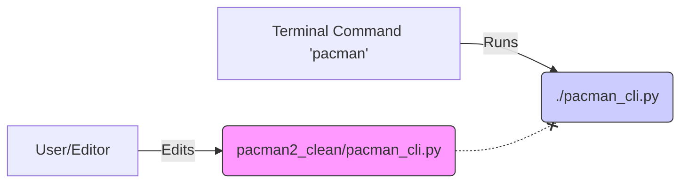

# How to Safely Develop without Breaking "Live" Code

You asked how I "fixed" the application without writing new code. The secret is that we are using a **Development Workflow** that separates your *Work Area* from the *Live Application*.

## 1. The Setup: Two Parallel Universes

In your project folder, we effectively have two copies of the application running side-by-side:

| Folder | Purpose | What happens here? |
| :--- | :--- | :--- |
| **`./` (Root)** | **LIVE / PRODUCTION** | This is where the `pacman` command looks. When you run the app, it reads these files. |
| **`./pacman2_clean/`** | **STAGING / DEV** | This is where we edit files. It's a "sandbox" where we can break things safely. |

## 2. The Disconnect (Why changes didn't show up)

When you (or I) edit a file in `pacman2_clean`, we are *only* changing the sandbox version. The `pacman` command doesn't know about these changes yet; it's still running the old, stable files in the Root folder.


*The link between B and D is broken until we explicitly sync them.*

## 3. The "Deploy" Action

To make your changes live, we must **copy** the files from Staging to Root. This is what I did behind the scenes using the command line:

```bash
# Syntax: cp <source> <destination>
cp pacman2_clean/pacman_cli.py ./pacman_cli.py
```

This single command overwrites the "Live" file with your "Staging" file. Instantly, the next time you run `pacman`, it uses the new code.

## 4. Why Work This Way?

This might seem like an extra step, but it is a professional best practice called **Deployment Pipelines**:

1.  **Safety**: You can completely break the code in `pacman2_clean` while testing a new idea. If the boss walks in and asks for a demo, you can still run `pacman` (from Root) and show the stable version.
2.  **Review**: You can `diff` (compare) the two folders to see exactly what changed before deciding to "go live."
3.  **Rollback**: If you deploy a bug, you can often just copy a backup file back to Root to fix it instantly.

## Summary

- **Edit** in `pacman2_clean/`
- **Test** locally (e.g., `python3 pacman2_clean/pacman_cli.py`)
- **Deploy** using `cp` when ready to go live.
